[中文](README.md) | [English](README.en-US.md)

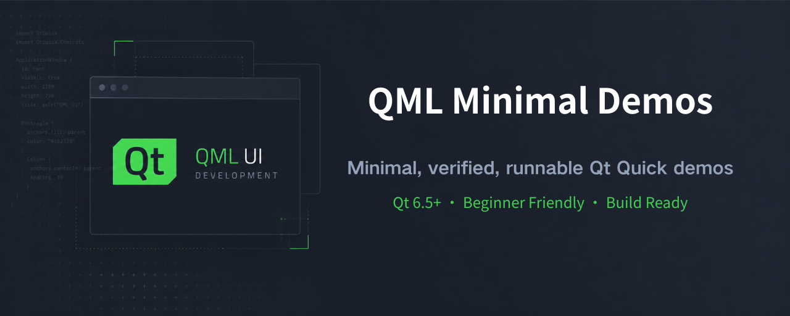

# QML-Minimal-Demos
A growing collection of runnable QML (Qt Quick) demos covering components, animations, layouts, charts, and particle   systems. Each example is minimal, verified, and ready to run with Qt 6.5+. Learning by doing, continuously expanding.

---

## Why This Collection

Qt's official QML documentation is relatively sparse, making it easy for beginners to feel lost.

Since 2025, I've been using my spare time to generate demo code with DeepSeek, then manually debug and fix issues — learning QML through the process of fixing bugs. The original demos were created on CSDN, and now I've iterated and optimized all of them into this collection.

## Environment Requirements

- Minimum Qt version: 6.5
- Current development environment: Win11 + Qt 6.8.2 / Qt 6.11.1
- Note: Qt 6 programs cannot run on Win7; versions after Qt 6.12 will drop Win10 support

## Who Is This For

### 1. Developers Interested in QML

This collection covers most commonly used QML components and patterns — from basic Hello World to particle systems, charts, and tables. Each example is a standalone, runnable minimal case. It's much more intuitive than reading official Qt documentation.

### 2. People Who Use AI to Generate QML Code But Encounter Errors

AI-generated QML code often has two types of issues:
- Using non-existent properties or signals
- Incorrect component nesting relationships

Every example in this collection has been verified through actual compilation and can serve as a "correct reference." When AI-generated code doesn't work, find a similar example here to see where the difference lies.

### 3. QML Beginners

Each example has a small codebase (usually 50-200 lines), focusing on demonstrating a single knowledge point. No complex project structure interference — perfect for starting with qml_hello and progressing gradually by category.

## How to Run Examples

1. Download or clone the repository to your local machine
2. Open the target example's `CMakeLists.txt` file using Qt Creator
3. Click run to see the effect

---

## qml_hello

A minimal QML example demonstrating text rendering with two basic animations: color transition and bounce effect. The "Hello World" text animates from the top of the window to the center while fading from white to dark gray.

---

## Basic Controls

### qml_layout

Demonstrating five basic layouts in Qt Quick. Includes Row, Column, Grid, Stack, and Flow examples, showcasing the arrangement rules and use cases of different layout managers.

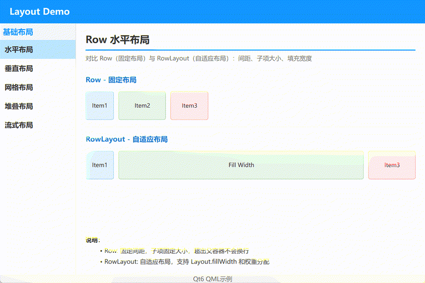

---

### qml_text

A demo showcasing Text and Label components in Qt Quick. Includes examples for basic text properties, font settings, text styles, alignment, wrapping, eliding, rich text (HTML), Markdown, links, font auto-fit, and clickable text.

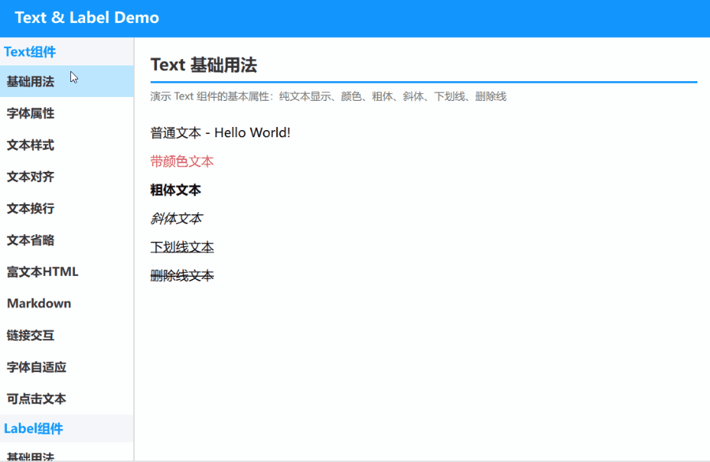

---

### qml_container

Demonstrating container components in Qt Quick. Includes Pane, Frame, GroupBox, custom GroupBox, ScrollView, and nested composition examples, showcasing basic container usage and layout nesting for complex UIs.

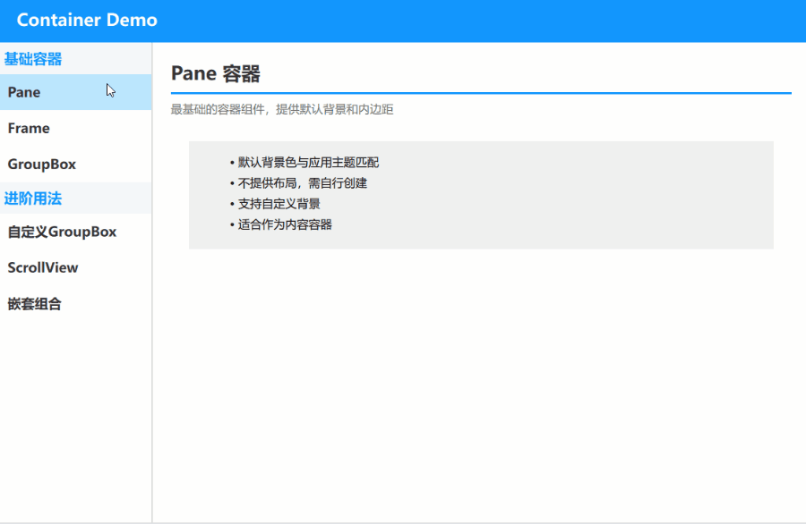

---

### qml_button

Demonstrating common buttons and selection controls in Qt Quick. Includes examples of Button, RoundButton, DelayButton, Switch, CheckBox, RadioButton, ToolButton, TabButton, ItemDelegate, and a custom button component.

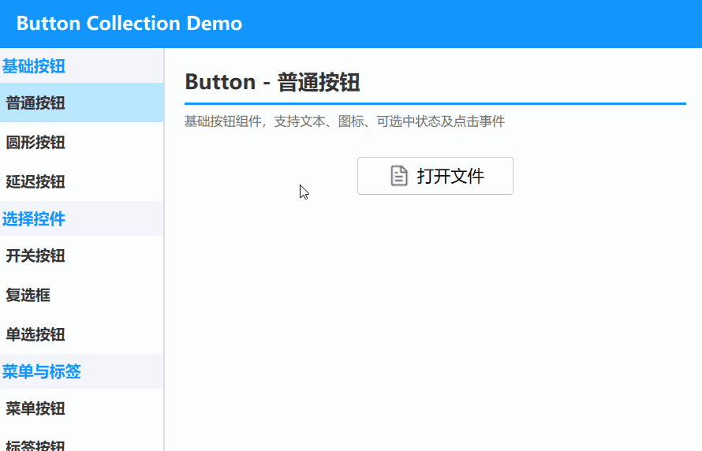

---

### qml_slider

Demonstrating `Slider` and `RangeSlider` components in Qt Quick. Includes basic slider, custom handle/track/tick marks, RangeSlider range selection, and scenario examples such as volume control and video progress bar.

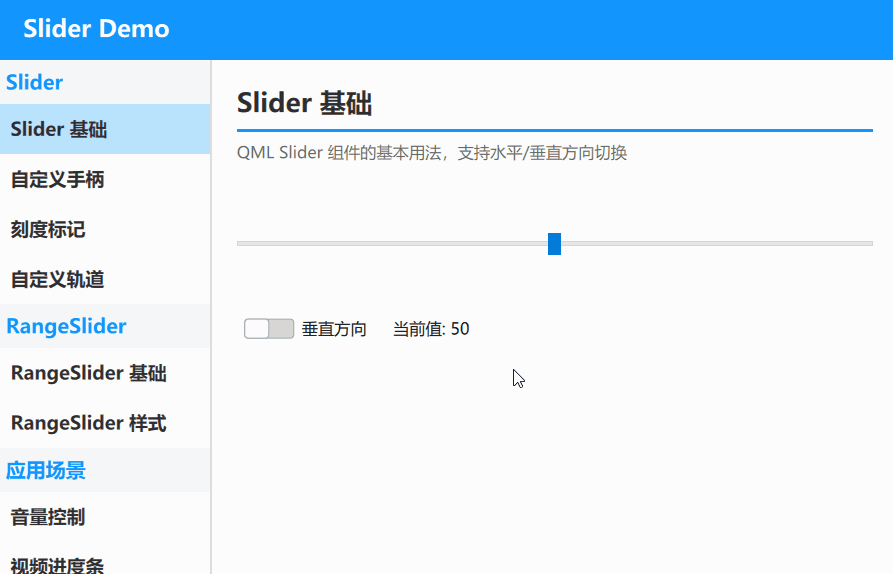

---

### qml_dial

Demonstrating the `Dial` knob component in Qt Quick. Includes basic dial, numeric display, custom styles, mouse/wheel/keyboard events, multi-dial linkage, scale drawing, and audio equalizer examples.

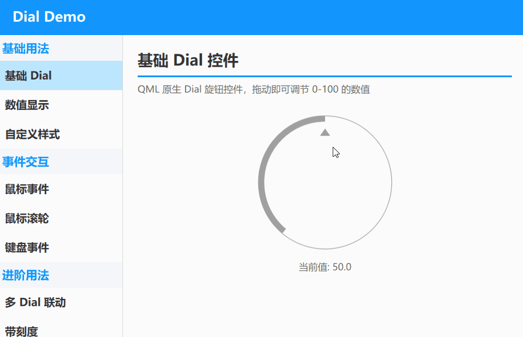

---

### qml_spinbox

Demonstrating the `SpinBox` numeric input component in Qt Quick. Includes basic SpinBox, custom step size, Basic and Material custom styles, as well as scale animation and rolling number list examples.

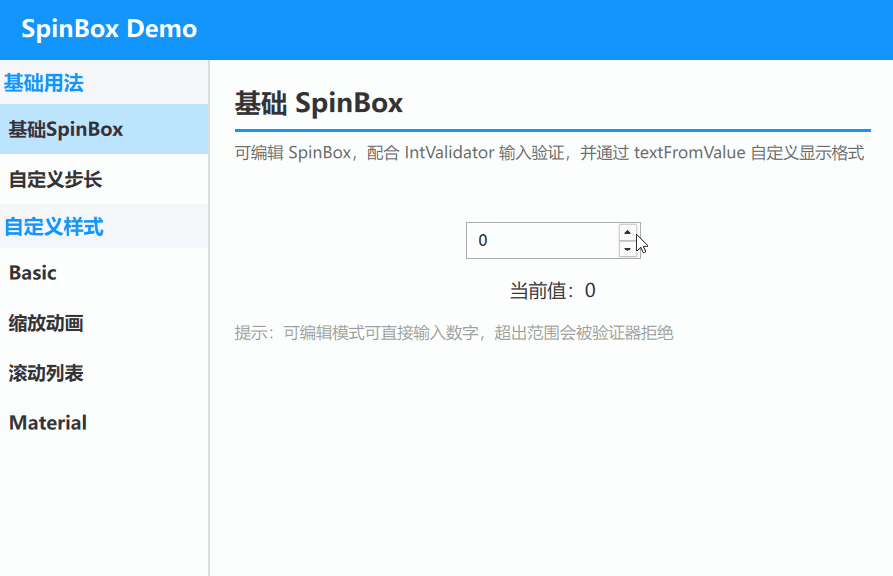

---

### qml_progressbar

A demo showcasing the `ProgressBar` component in Qt Quick. Includes examples of default style, smooth animation, custom rectangle, Material style, indeterminate stripe animation, as well as circular and multi-ring progress.

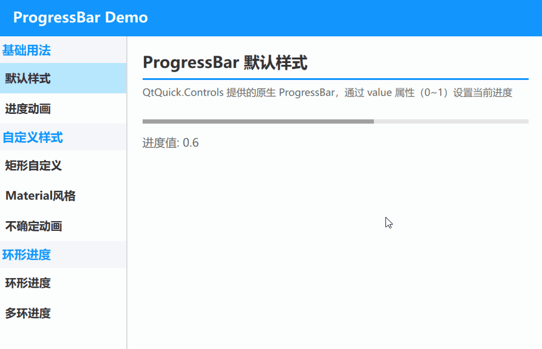

---

### qml_combobox

A demo showcasing the `ComboBox` dropdown selection component in Qt Quick. Includes basic usage with string arrays and ListModel multi-role models; advanced usage such as custom display text, disabled items, editable input, dynamic model updates, grouped and multi-column layouts, and performance optimization for 10,000-item datasets; plus fully custom Basic styles and Material theme styles.

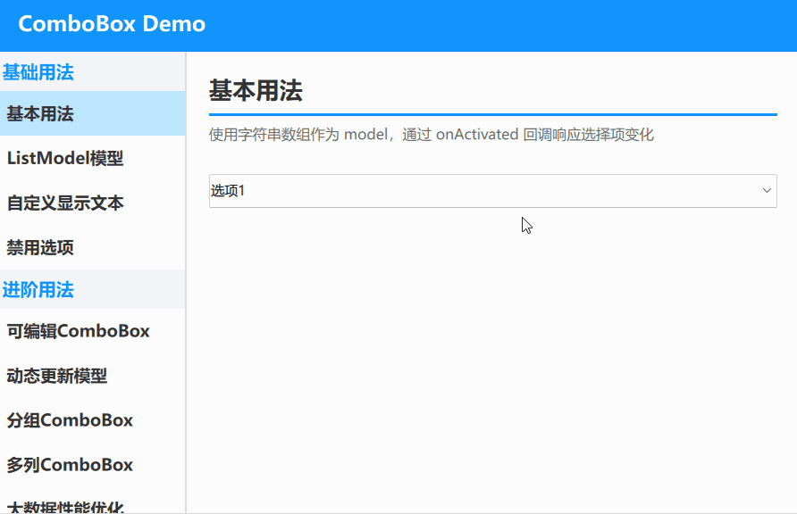

---

## Interaction Basics

### qml_signals

A demo showcasing signal and slot mechanisms in Qt Quick. Includes examples of direct binding, cross-file communication, JS dynamic connections, and C++ to QML signal interoperation.

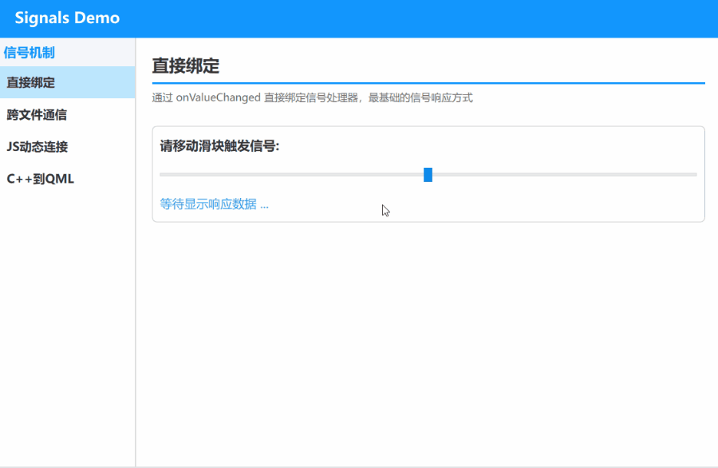

---

### qml_timer

A demo showcasing basic usage of the Timer component in Qt Quick. Includes examples of single-shot, repeat, triggered-on-start, and using Timer to control animations.

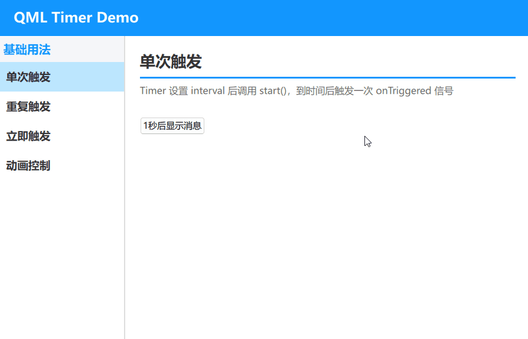

---

### qml_js_interaction

A demo showcasing QML and JavaScript interaction in Qt Quick. Includes examples of inline JS functions, importing external JS files, JS functions as slots, and WorkerScript worker threads.

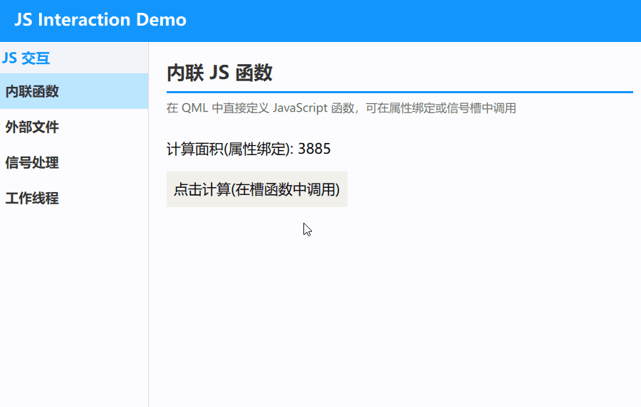

---

## Animation & Effects

### qml_busyindicator

A demo showcasing the BusyIndicator loading indicator in Qt Quick. Includes examples of basic usage, native implementation with custom colors, notched rectangle ring, and Shape arc animation.

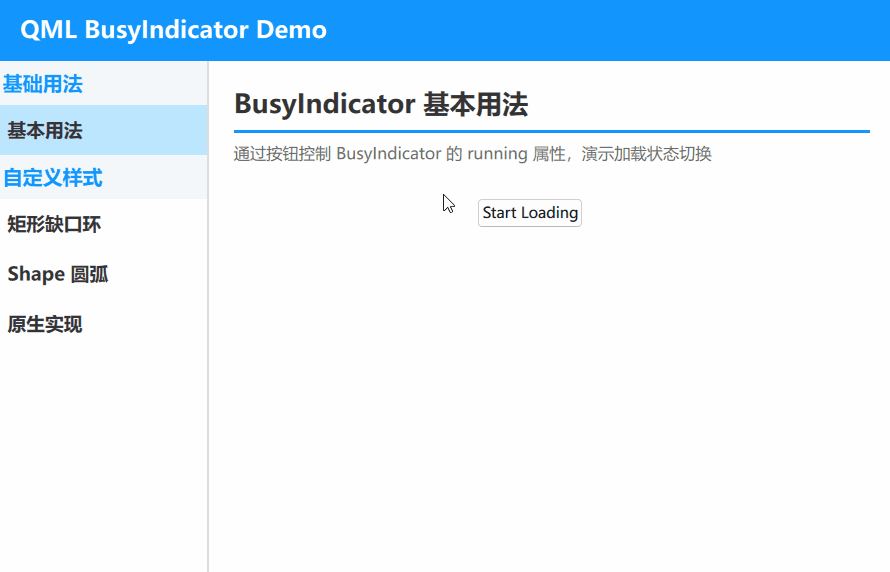

---

### qml_tumbler

A demo showcasing the `Tumbler` wheel selector component in Qt Quick. Includes examples of basic time selection, color picker, fade gradient, highlight background, 3D rotation, date selection, linked date selection, and horizontal scrolling.

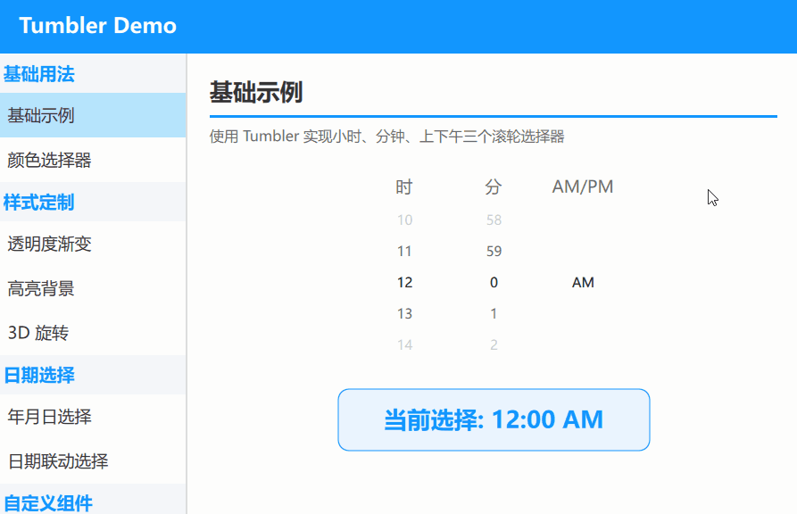

---

## Popups & Dialogs

### qml_windowflags

A demo showcasing various window flags and popup components in Qt Quick. Includes Popup, Dialog, and custom popups, as well as window flag examples like Tool, ToolTip, SplashScreen, Frameless, StayOnTop, and Dialog.

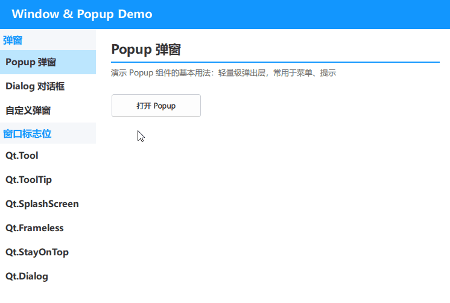

---

### qml_tooltip

A demo showcasing the ToolTip component in Qt Quick. Includes examples of basic hover tips, custom styles, rich text tips, and shadow effects.

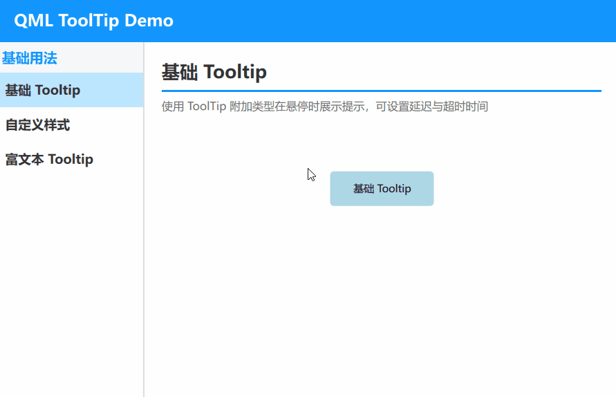

---

## qml_textarea

A demo showcasing the TextArea component (multi-line text editing) in Qt Quick. Includes basic examples for text editing, font & color, rich text, and wrap modes; style examples for custom styles, dark theme, and Material style; and application examples like text search, a line-numbered text editor, a Markdown editor, scroll retention, and loading large text.

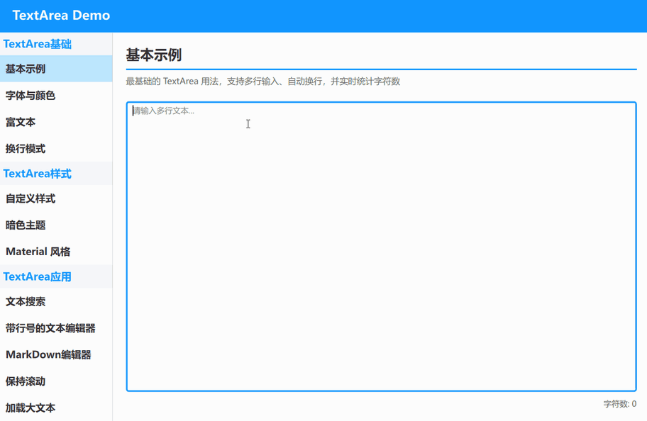

---

## qml_textfield

A demo showcasing the TextField component (single-line input) in Qt Quick. Includes basic examples for input and input limits; various validation rules such as age, email, phone, input mask & date, IP address, and ID card; style examples for custom text fields, icon fields, clearable fields, and theme switching; and application examples like auto-suggest and form submission.

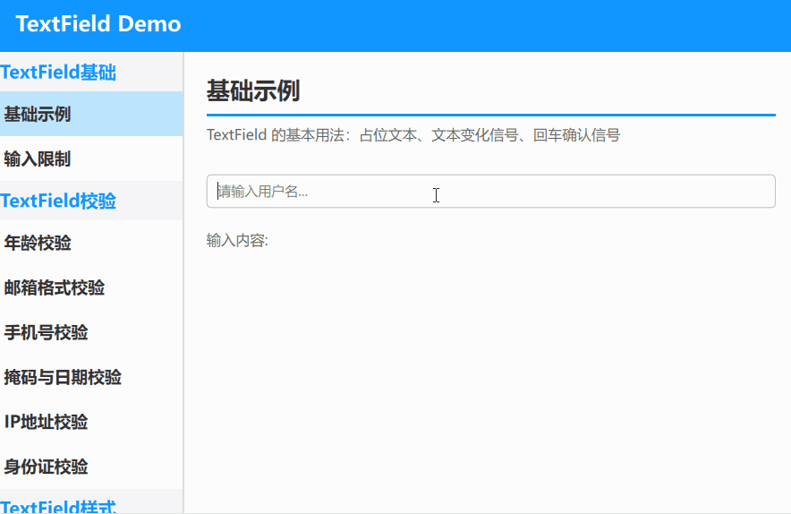

---

**To be continued...**
