[中文](README.md) | [English](README.en-US.md)

# QML-Minimal-Demos

一个持续增长的可运行 QML (Qt Quick) 示例集合，涵盖组件、动画、布局、图表和粒子系统。每个示例都力求简洁、经过验证，可在 Qt 6.5+ 上直接运行。边学边做，持续扩展。

---

## 为什么做这个集合

Qt 官方的 QML 文档相对稀疏，初学者容易感到迷茫。

从 2025 年开始，我利用业余时间用 DeepSeek 生成 demo 代码，然后手动调试和修复问题——在修 bug 的过程中学习 QML。最初的 demo 发布在 CSDN 上，后来我逐步迭代优化，收录到这个集合中。

## 环境要求

- 最低 Qt 版本：6.5
- 当前开发环境：Win11 + Qt 6.8.2 / Qt 6.11.1
- 注意：Qt 6 程序无法在 Win7 上运行；Qt 6.12 之后的版本将不再支持 Win10

## 适用人群

### 1. 对 QML 感兴趣的开发者

本集合涵盖了最常用的 QML 组件和模式——从基础 Hello World 到粒子系统、图表和表格。每个示例都是独立可运行的最小案例，比阅读官方文档更直观。

### 2. 用 AI 生成 QML 代码但遇到错误的人

AI 生成的 QML 代码常出现两类问题：
- 使用不存在的属性或信号
- 组件嵌套关系错误

本集合中的每个示例都经过实际编译验证，可以作为"正确参考"。当 AI 生成的代码不工作时，找一个类似的示例对比差异即可。

### 3. QML 初学者

每个示例代码量小（通常 50-200 行），专注于演示单一知识点。没有复杂项目结构干扰——非常适合从 qml_hello 开始，按类别逐步进阶。

## 如何运行示例

1. 下载或克隆仓库到本地
2. 使用 Qt Creator 打开目标示例的 `CMakeLists.txt` 文件
3. 点击运行即可看到效果

---

## qml_hello

一个最小化 QML 示例，演示文字渲染配合两种基础动画：颜色过渡和弹跳效果。"Hello World" 文字从窗口顶部动画移动到中心，同时从白色渐变为深灰色。

---

## 基础控件篇

### qml_layout

演示 Qt Quick 中的五种基础布局。包含 Row（水平布局）、Column（垂直布局）、Grid（网格布局）、Stack（堆叠布局）和 Flow（流式布局）示例，展示不同布局管理器的排列规则与适用场景。

---

### qml_text

演示 Qt Quick 中的 Text 和 Label 组件。包含基础文本属性、字体设置、文本样式、对齐、换行、省略、富文本(HTML)、Markdown、链接交互、字体自适应和可点击文本等示例。

---

### qml_container

演示 Qt Quick 中的容器组件。包含 Pane、Frame、GroupBox、自定义 GroupBox、ScrollView 和嵌套组合示例，展示基础容器的用法和复杂界面的布局嵌套。

---

### qml_button

演示 Qt Quick 中常用按钮和选择控件。包含 Button、RoundButton、DelayButton、Switch、CheckBox、RadioButton、ToolButton、TabButton、ItemDelegate 以及自定义按钮组件示例。

---

### qml_slider

演示 Qt Quick 中 `Slider` 与 `RangeSlider` 滑块控件的用法。包含基础滑块、自定义手柄/轨道/刻度、RangeSlider 范围选择，以及音量控制和视频进度条等场景化示例。

---

### qml_dial

演示 Qt Quick 中 `Dial` 旋钮控件的用法。包含基础旋钮、数值显示、自定义样式、鼠标/滚轮/键盘事件、多 Dial 联动、刻度绘制以及音频均衡器等示例。

---

### qml_spinbox

演示 Qt Quick 中 `SpinBox` 数字输入框的用法。包含基础 SpinBox、自定义步长、Basic 与 Material 自定义样式，以及缩放动画和数字滚动列表等示例。

---

### qml_tumbler

演示 Qt Quick 中 `Tumbler` 滚轮选择器的用法。包含基础时间选择、颜色选择器、透明度渐变、高亮背景、3D 旋转、年月日选择、日期联动选择和水平滚动等示例。

---

### qml_progressbar

演示 Qt Quick 中 `ProgressBar` 进度条的用法。包含默认样式、平滑动画、矩形自定义、Material 风格、条纹不确定动画，以及环形和多环进度等示例。

---

### qml_textfield

演示 Qt Quick 中的 TextField 单行输入组件。包含基础输入与输入限制等基础示例，年龄、邮箱、手机号、掩码与日期、IP 地址、身份证等多种校验规则，自定义文本框、带图标、带删除按钮、主题切换等样式示例，以及自动关联、表单提交等应用示例。

---

### qml_textarea

演示 Qt Quick 中的 TextArea 多行文本编辑组件。包含基础文本编辑、字体与颜色、富文本、换行模式等基础示例，自定义样式、暗色主题、Material 风格等样式示例，以及文本搜索、带行号的文本编辑器、Markdown 编辑器、保持滚动、加载大文本等应用示例。

---

### qml_combobox

演示 Qt Quick 中 `ComboBox` 下拉选择框的用法。包含字符串数组与 ListModel 多角色模型等基础用法，自定义显示文本、禁用选项、可编辑输入、动态更新模型、分组与多列展示、万级大数据性能优化，以及 Basic 完全自定义样式和 Material 主题样式等示例。

---

## 交互基础篇

### qml_signals

演示 Qt Quick 中的信号与槽机制。包含直接绑定、跨文件通信、JS 动态连接以及 C++ 到 QML 的信号互操作示例。

---

### qml_timer

演示 Qt Quick 中 Timer 组件的基础用法。包含单次触发、重复触发、启动立即触发以及用 Timer 控制动画等示例。

---

### qml_date

演示 Qt Quick 中日期时间的格式化、解析、选择与可视化。包含 Locale 长/短格式与自定义格式字符串、多地区日期显示（中文/英文/德文/日文/法文）、字符串解析与时间戳互转、基于 Tumbler 的时分与年月日时分选择器（含月份天数联动），以及 Canvas 2D 模拟时钟等示例。

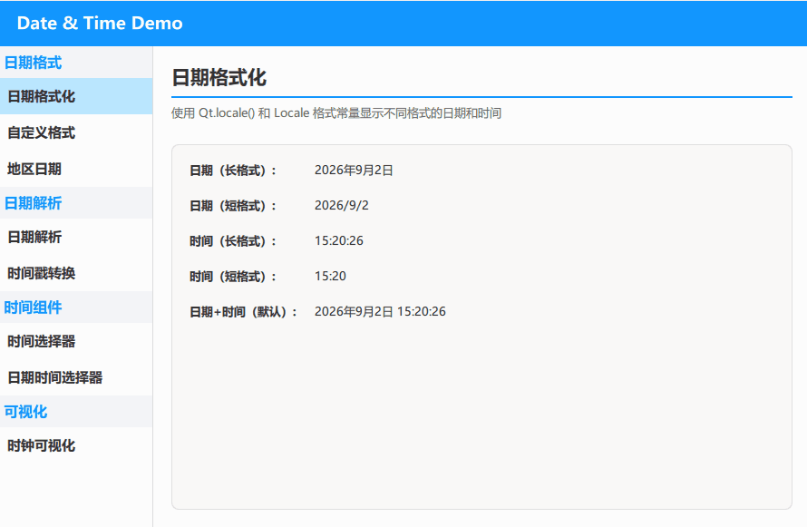

---

### qml_js_interaction

演示 Qt Quick 中 QML 与 JavaScript 的交互方式。包含内联 JS 函数、导入外部 JS 文件、JS 函数作为信号槽以及 WorkerScript 工作线程示例。

---

### qml_mousearea

演示 Qt Quick 中 MouseArea 鼠标交互区域的用法。包含基础点击与悬停、单击与双击、长按与多按键、鼠标拖拽、滚轮缩放、事件传递以及自定义按钮等示例。

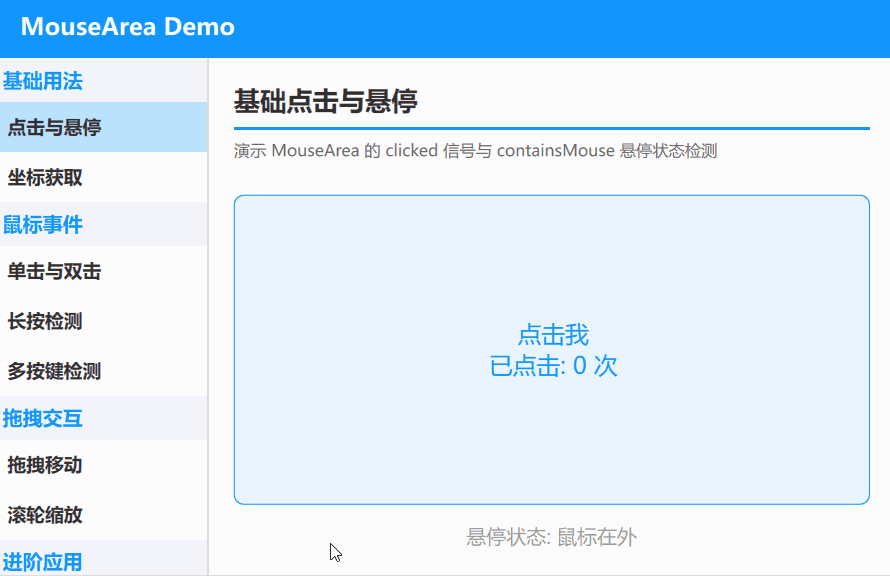

---

### qml_shortcut

演示 Qt Quick 中 Shortcut 快捷键组件的用法。包含基础快捷键、组合键序列、单键与修饰键组合、快捷键菜单、状态切换、上下文作用域以及多快捷键管理等示例。

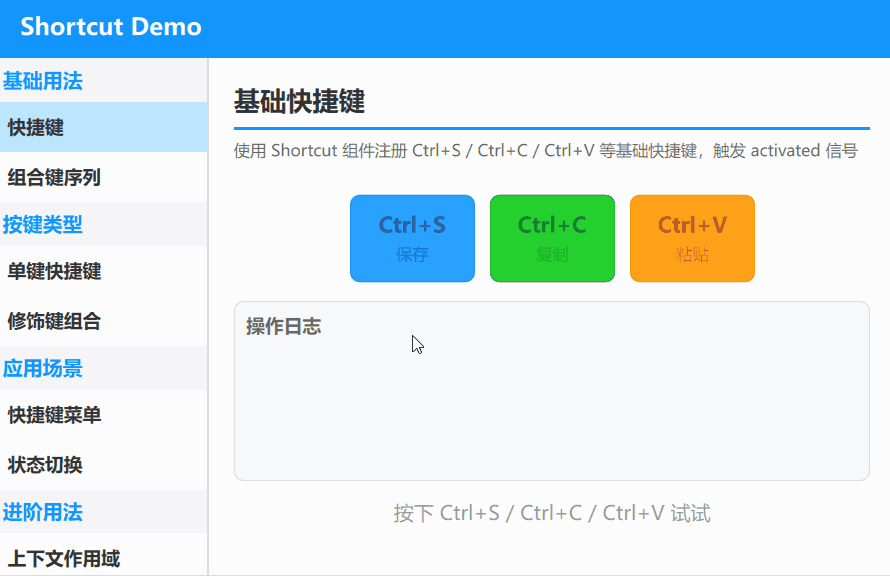

---

### qml_keys_focus

演示 Qt Quick 中 Keys 按键与焦点管理的用法。包含按键基础、按键修饰符、焦点作用域与强制焦点、键盘导航、Tab 键导航、按键传播以及游戏控制等示例。

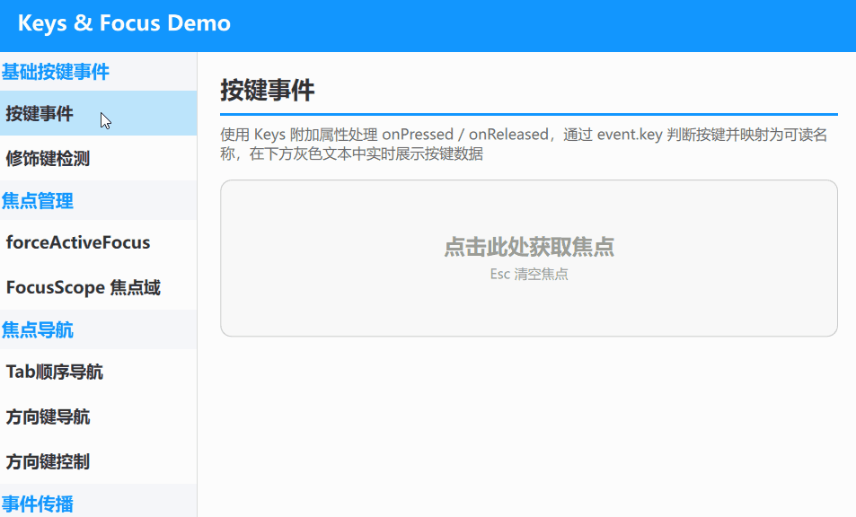

---

### qml_drag_drop

演示 Qt Quick 中拖拽与 DropArea 放置区的用法。包含自由拖拽与单轴约束、DropArea 接收拖拽与数据交换、拖拽吸附与列表排序、看板跨列拖拽以及数字拼图等示例。

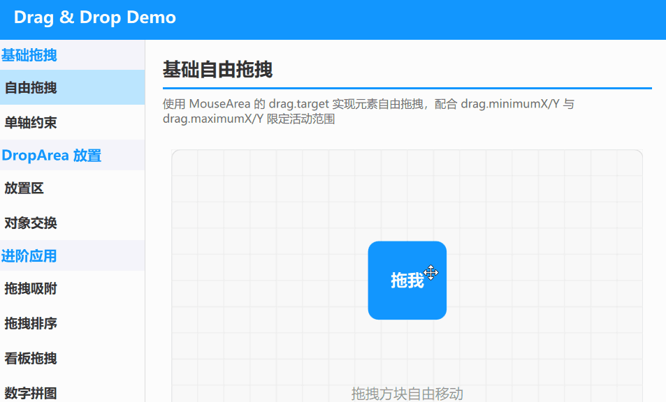

---

## 视图导航篇

### qml_page

演示 Qt Quick Controls 中 Page 页面组件的用法。包含基础 Page 与 header/footer 自动布局、多页面嵌套结构，Page 内嵌 StackLayout、SwipeView、StackView 做容器宿主（含 Page.title 宿主读取），以及 header/footer 动态显隐时页面内容自适应伸缩等示例。

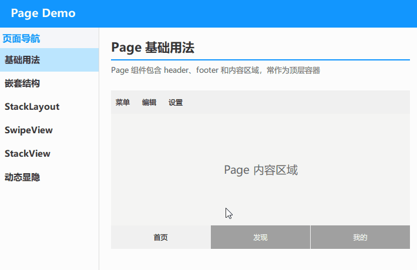

---

### qml_loader

演示 Qt Quick 中 Loader 动态加载组件的用法。包含从文件加载（`source`）与加载内联组件（`sourceComponent`）、加载状态监听（`status` / `onLoaded`）、动态标签页切换（换页即销毁重建）、`Qt.createComponent` / `createObject` 动态创建控件、Timer 延迟加载、条件切换组件，以及属性传递与 `loader.item` 访问等示例。

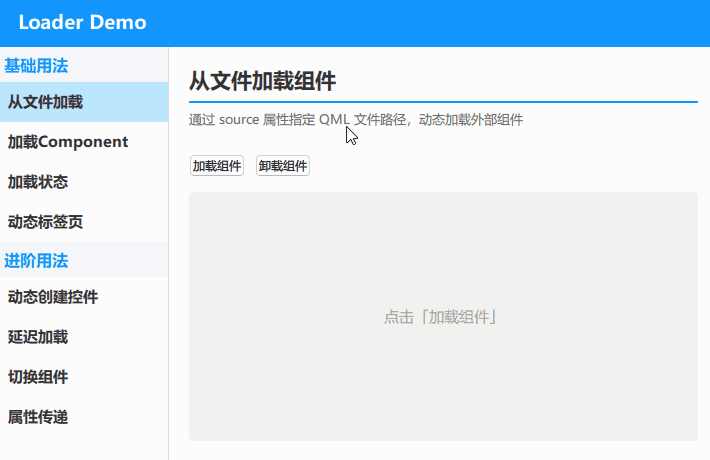

---

### qml_tabbar

演示 Qt Quick Controls 中 TabBar 页签导航的用法。包含基础 TabBar（`currentIndex` 切换）与放入 Page.header/footer 自动定位、自定义 TabButton（`contentItem` / `background` / 选中态）、Repeater 配合 ListModel 动态增删标签，以及与 StackLayout 单向联动、与 SwipeView 双向绑定（`TabBar.index` 附加属性）等示例。

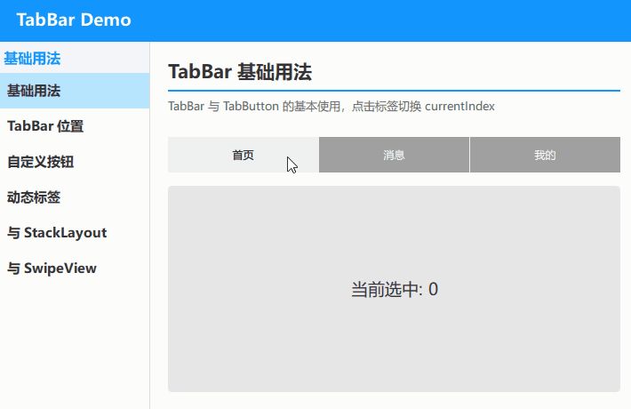

---

### qml_swipeview

演示 Qt Quick Controls 中 SwipeView 滑动翻页容器的用法。包含基础 SwipeView 配合 PageIndicator 指示器、自定义指示器 delegate、与 TabBar 双向联动、配合 Loader 只创建相邻页的懒加载（`isCurrentItem` / `isNextItem` / `isPreviousItem`），以及翻页 + 自动轮播 + 暂停控制的简易图片浏览器应用等示例。

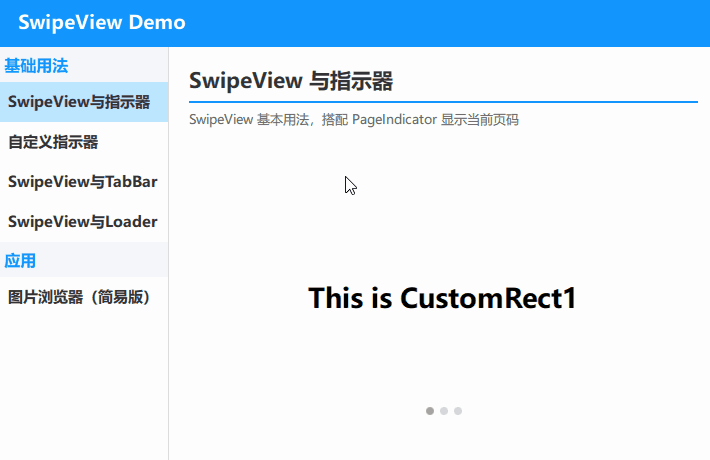

---

### qml_stackview

演示 Qt Quick Controls 中 StackView 页面栈的用法。包含 push / pop / replace 基本操作与 `StackView.Immediate` 无动画切换、批量 push / pop 与清空栈（`pushItems` / `depth`）、自定义 push/pop 进出场过渡动画、与 TabBar 联动查栈跳转（`pop(item)` / `get()`）、push Item / Component / URL 三种传参方式（含属性注入与信号连接），以及基于 `StackView.index` 位移的卡片堆叠效果等示例。

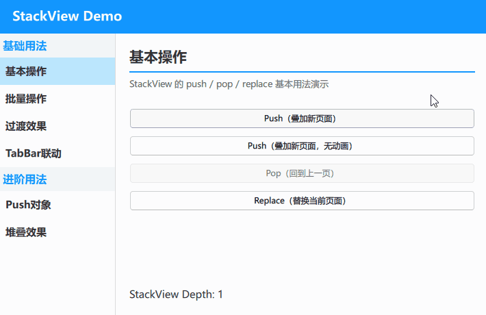

---

### qml_action_button_group

演示 Qt Quick 中 Action 动作共享与 ButtonGroup 按钮组的用法。包含 Action 基础复用与快捷键绑定、ButtonGroup 单选互斥与多选父子联动等示例。

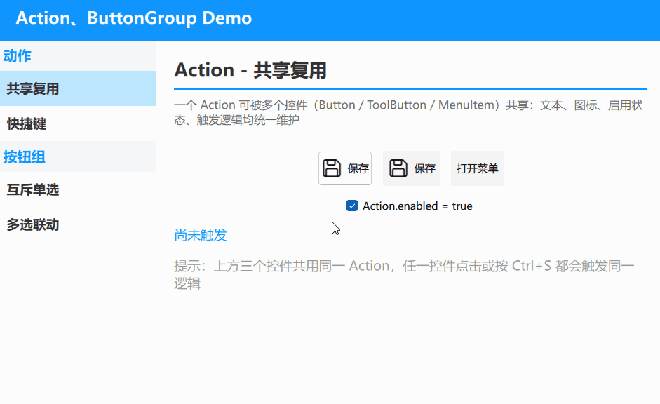

---

### qml_drawer

演示 Qt Quick 中 Drawer 抽屉式导航的用法。四个方向的抽屉集中在同一页对比：顶部消息通知、右侧功能设置（含开关列表）、底部常用功能宫格、左侧导航（选中项高亮并回传），统一用 `parent: Overlay.overlay` 贴住窗口边缘滑出，并支持点击遮罩收起。

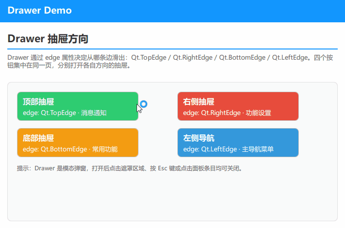

---

### qml_navigation_layout

演示 Qt Quick 中四种常见导航布局的写法与选型。包含顶部导航栏（配合 StackView 页面栈与四段进出场转场）、抽屉式导航（遮罩层加 `Behavior on x` 滑出面板）、侧边导航栏（左栏常驻 + StackLayout 换页），以及底部导航栏（图标加文字 Tab，一份数据同时驱动内容区与 Tab 条两处界面）。

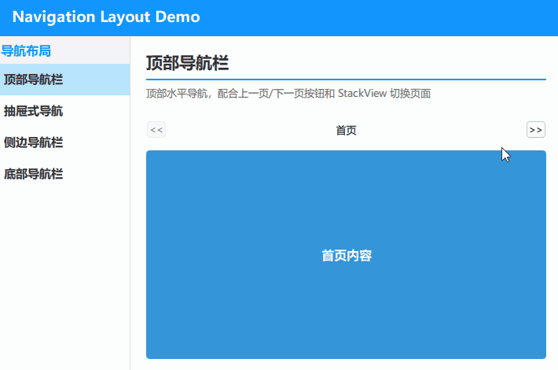

---

## 数据视图篇

### qml_repeater

演示 Qt Quick 中 Repeater 基于模型重复生成元素的用法。包含整数、JS 数组、字符串数组等基础模型，以及 ListModel 与 C++ `QAbstractListModel` 数据模型（配合 `beginInsertRows` / `endInsertRows` 同步视图），并统一提供增加/减少数量的交互按钮，直观对比各模型在增删元素时的通知差异。

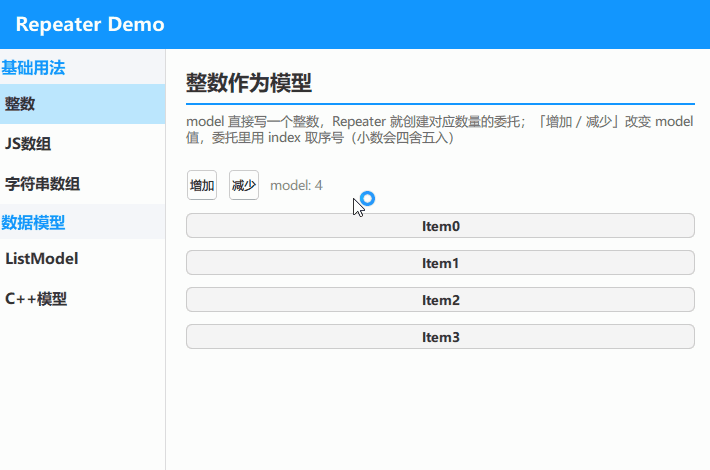

---

### qml_delegatechoice

演示 Qt Quick 中 DelegateChooser / DelegateChoice 按数据选择不同委托的用法。包含按角色值（`roleValue`）匹配、按索引（`index`）匹配、多条件组合（条件为"与"关系、按声明顺序取第一个命中），以及 TableView 专用的按列（`column`）匹配等示例。

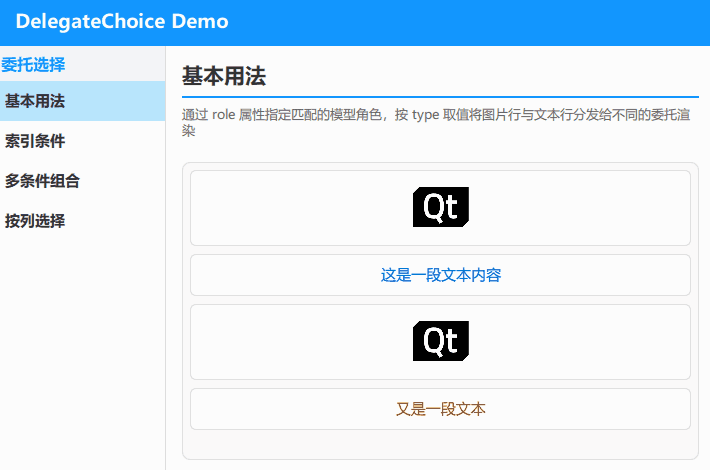

---

### qml_itemdelegate

演示 Qt Quick 中各类 ItemDelegate 列表项委托的样式与交互。包含基础点击、复选、单选、开关四种基础委托（操作指示器统一左置，右侧留白避免被滚动条遮挡），左右滑动露出删除/归档与滑动露出背景两种 SwipeDelegate（滑动时裁剪，避免文字残留），以及基于 C++ 树模型的 TreeViewDelegate 树形列表。

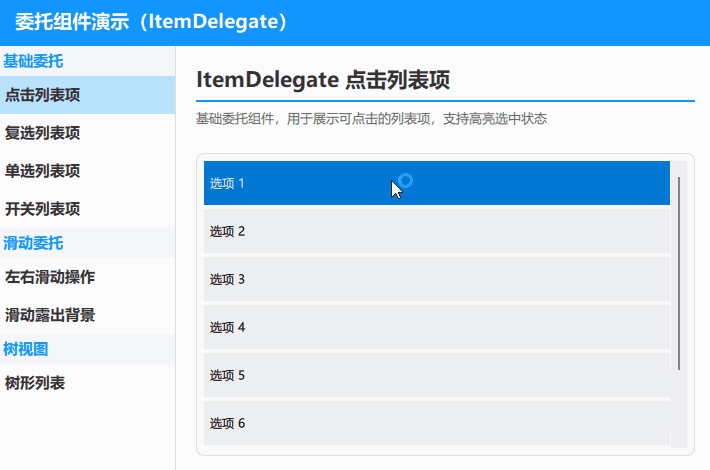

---

### qml_pathview

演示 Qt Quick 中 PathView 让模型项沿自定义路径排布的用法。包含直线路径与 PathQuad 曲线路径（控制点位置可实时拖动调整）两种基础路径，一个用 `highlight` 高亮框与吸附目标线来演示 `highlightRangeMode`、`snapMode` 如何共同决定项落点的对齐示例，以及用 PathAngleArc 闭合圆路径实现的环形轮播。

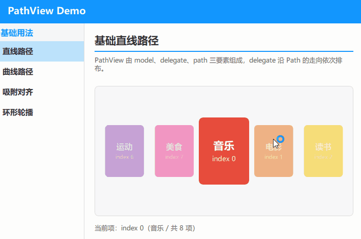

---

### qml_listview

演示 Qt Quick 中 ListView 列表视图的用法。包含自定义样式与滚动交互、条目点击与动态数据管理，以及基于 ListModel 和 C++ `QAbstractListModel` 驱动、支持搜索过滤的联系人列表（点击查看详情）等示例。

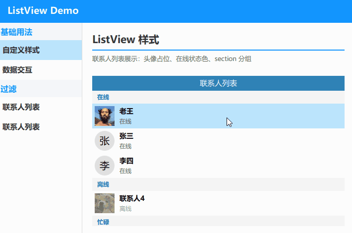

---

### qml_tableview

演示 Qt Quick 中 TableView 表格视图的用法。包含自定义表头与单元格样式、点击表头排序，以及双击单元格直接编辑，和连接 SQLite 数据库实现增删改查等示例。

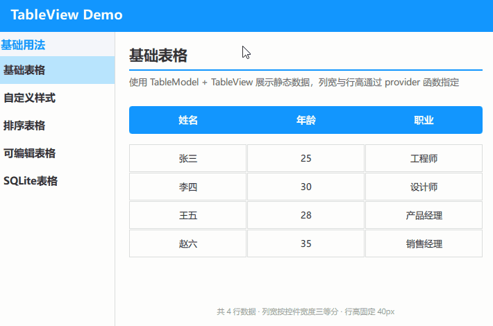

---

### qml_treeview

演示 Qt Quick 中 TreeView 树形视图的用法。包含基础树结构与展开/折叠、完全自定义委托（文件树样式、悬停与展开提示），以及分层排序和按关键字搜索过滤（保留父节点、自动展开）等示例。

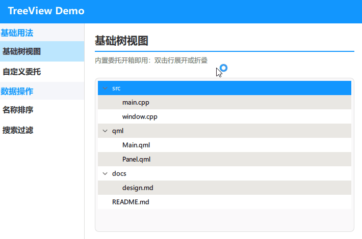

---

## 滚动反馈篇

### qml_scrollbar

演示 Qt Quick 中 ScrollBar 滚动条的用法。包含 ScrollView 与 Flickable 中的基础滚动、ScrollIndicator 滚动指示器，以及自定义滚动条样式等示例。

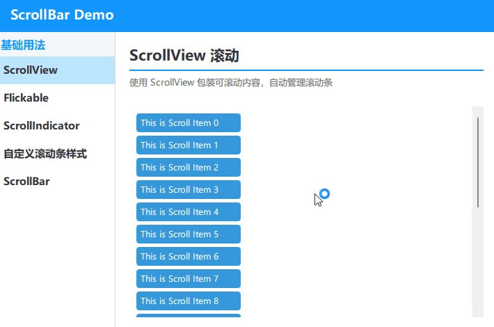

---

### qml_separator

演示 Qt Quick 中分隔线 Separator 的多种写法。包含 Rectangle 分隔线、MenuSeparator 菜单分隔线、ToolSeparator 工具栏分隔线，以及可复用的自定义 Divider 组件等示例。

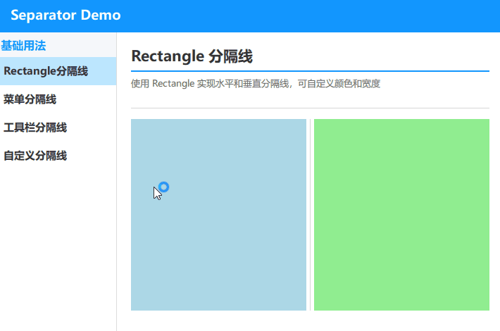

---

### qml_splitview

演示 Qt Quick 中 SplitView 可拖拽分隔面板的用法。包含基础分割与拖拽调整尺寸、自定义 handle 手柄样式、多面板嵌套布局，以及分割位置的状态持久化等示例。

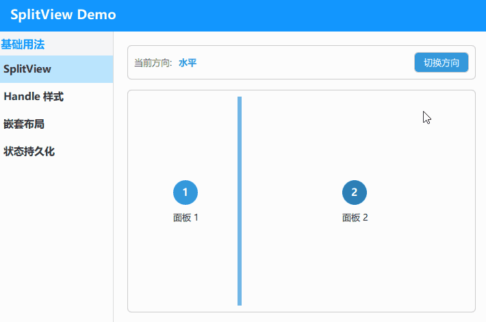

---

### qml_flickable_flipable

演示 Qt Quick 中 Flickable 滚动与 Flipable 翻转的用法。包含基础滚动与边界弹性回弹、ScrollBar/Bounds 边界行为，以及翻转卡片、登录表单翻转等 Flipable 动画示例。

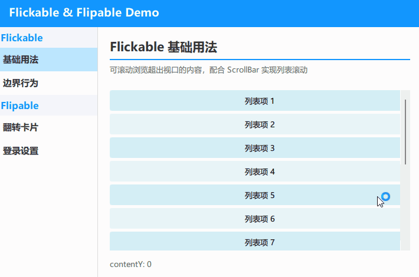

---

## 动画效果篇

### qml_busyindicator

演示 Qt Quick 中 BusyIndicator 加载指示器的用法。包含基础用法、原生实现自定义配色、矩形缺口环和 Shape 圆弧动画等示例。

---

### qml_lottie

演示 Qt Quick 中基于 `Qt.labs.lottieqt` 的 LottieAnimation 播放 Lottie JSON 动画。包含多路动画同屏独立播放的展示墙、播放/暂停/停止/从头播放等播放控制、帧级拖拽、方向/循环次数控制等示例。

> **运行提示**：推荐使用 **Qt 6.11** 运行本工程（完整支持 Lottie 动画）；**Qt 6.8** 也能跑起来，但部分动画显示不全。

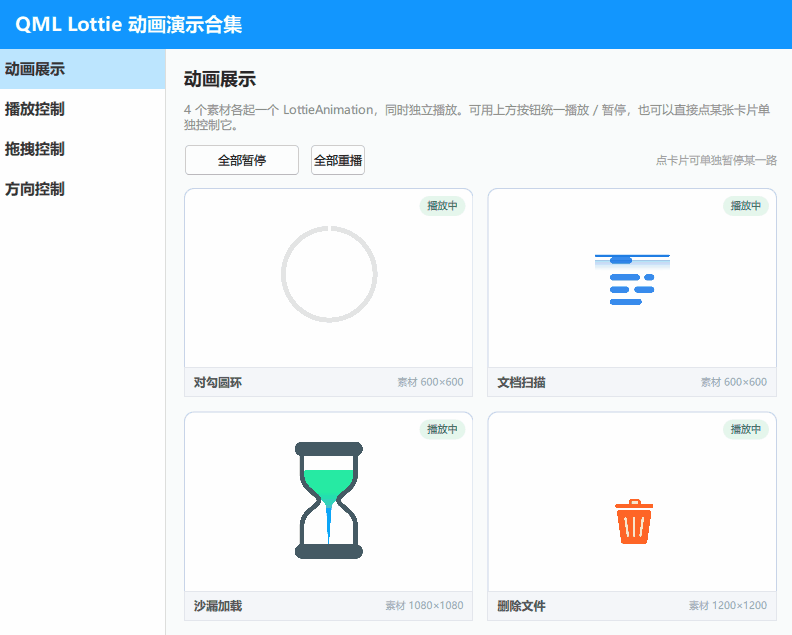

---

## 弹窗对话篇

### qml_windowflags

演示 Qt Quick 中各种窗口标志位和弹出组件。包含 Popup、Dialog 和自定义弹窗，以及 Tool、ToolTip、SplashScreen、Frameless、StayOnTop、Dialog 等窗口标志位示例。

---

### qml_tooltip

演示 Qt Quick 中 ToolTip 组件的用法。包含基础悬停提示、自定义样式、富文本提示与阴影效果等示例。

---

**持续更新中...**