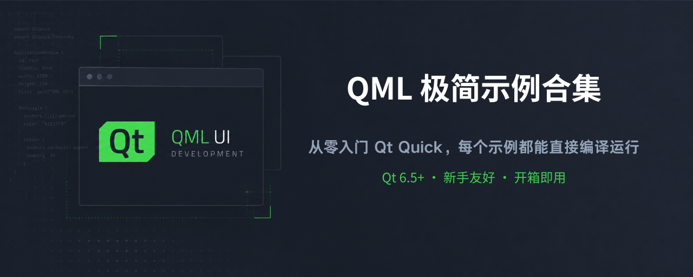
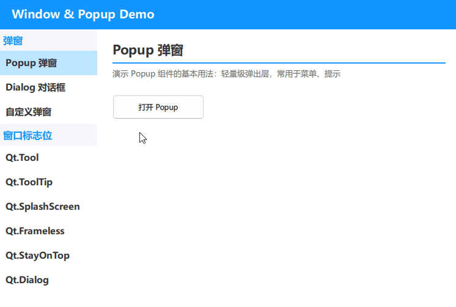
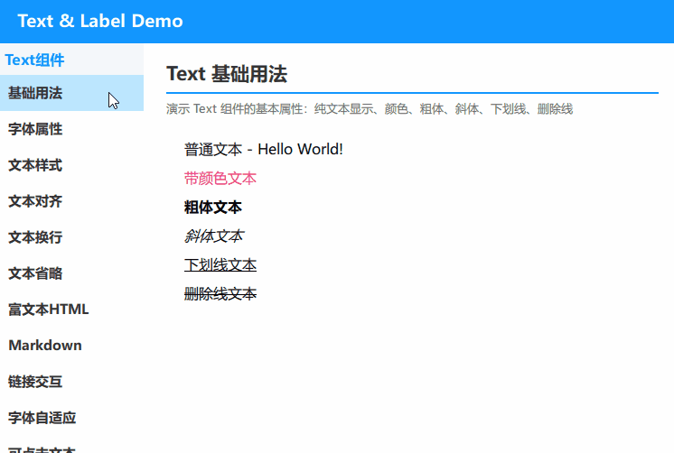

[English](README.md) | [中文](README.zh-CN.md)

# QML-Minimal-Demos

一个持续增长的可运行 QML (Qt Quick) 示例集合，涵盖组件、动画、布局、图表和粒子系统。每个示例都力求简洁、经过验证，可在 Qt 6.5+ 上直接运行。边学边做，持续扩展。

---

## 为什么做这个集合

Qt 官方的 QML 文档相对稀疏，初学者容易感到迷茫。

从 2025 年开始，我利用业余时间用 DeepSeek 生成 demo 代码，然后手动调试和修复问题——在修 bug 的过程中学习 QML。最初的 demo 发布在 CSDN 上，后来我逐步迭代优化，收录到这个集合中。

## 环境要求

- 最低 Qt 版本：6.5
- 当前开发环境：Win11 + Qt 6.8.2 / Qt 6.11.1 / 即将推出 Qt 6.12
- 注意：Qt 6 程序无法在 Win7 上运行；Qt 6.12 之后的版本将不再支持 Win10

## 适用人群

### 1. 对 QML 感兴趣的开发者

本集合涵盖了最常用的 QML 组件和模式——从基础 Hello World 到粒子系统、图表和表格。每个示例都是独立可运行的最小案例，比阅读官方文档更直观。

### 2. 用 AI 生成 QML 代码但遇到错误的人

AI 生成的 QML 代码常出现两类问题：
- 使用不存在的属性或信号
- 组件嵌套关系错误

本集合中的每个示例都经过实际编译验证，可以作为"正确参考"。当 AI 生成的代码不工作时，找一个类似的示例对比差异即可。

### 3. QML 初学者

每个示例代码量小（通常 50-200 行），专注于演示单一知识点。没有复杂项目结构干扰——非常适合从 qml_hello 开始，按类别逐步进阶。

## 如何运行示例

1. 下载或克隆仓库到本地
2. 使用 Qt Creator 打开目标示例的 `CMakeLists.txt` 文件
3. 点击运行即可看到效果

---

## qml_hello

一个最小化 QML 示例，演示文字渲染配合两种基础动画：颜色过渡和弹跳效果。"Hello World" 文字从窗口顶部动画移动到中心，同时从白色渐变为深灰色。

---

## qml_windowflags

演示 Qt Quick 中各种窗口标志位和弹出组件。包含 Popup、Dialog 和自定义弹窗，以及 Tool、ToolTip、SplashScreen、Frameless、StayOnTop、Dialog 等窗口标志位示例。

---

## qml_text

演示 Qt Quick 中的 Text 和 Label 组件。包含基础文本属性、字体设置、文本样式、对齐、换行、省略、富文本(HTML)、Markdown、链接交互、字体自适应和可点击文本等示例。

---

## qml_container

演示 Qt Quick 中的容器组件。包含 Pane、Frame、GroupBox、自定义 GroupBox 样式、ScrollView 以及多层嵌套组合等示例。

---

**持续更新中...**
